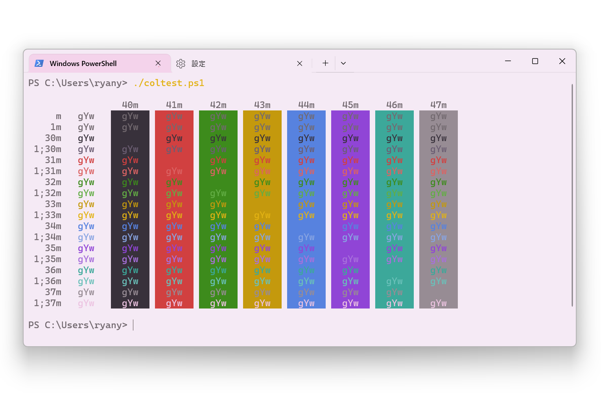

# ColTest
Show your terminal ANSI color scheme on Windows Terminal!

*theme: [Huacat Pink Theme](https://github.com/huacat-pink/windows-terminal/)*

## Installation
- Download the Source code and extract them.
- Copy [coltest.ps1](coltest.ps1) to wherever you like (you can also add it to PATH)

## Usage
just type the following in PowerShell
```ps1
./coltest.ps1
```
and the color table will be shown

## Introduction
there is [pablopunk/colortest](https://github.com/pablopunk/colortest) for showing the terminal colors, which is very easy to use. However, it only supports Unix systems (and WSL) and **can't run on Windows PowerShell**.

the Microsoft Team has also released [Colortool](https://github.com/microsoft/terminal/blob/main/src/tools/ColorTool/README.md) for modifying ANSI colors on legacy cmd (Windows Console Host). the `colortool -c` can show the current color of legacy cmd, however, not the color scheme of Windows Terminal currently applied. (presumably legacy cmd and Windows Termianl don't share the same coloring system)
> PS: this can be solved by executing `colortool campbell.ini` in Windows Terminal, which make colortool recognize the colorscheme in the new terminal 

As a result of that, I converted the script created by [@pablopunk](https://github.com/pablopunk) to the powershell one. the color table generated by this script depends on the current color scheme you are using on Windows Terminal rather than the old one of Windows Console Host APP.

I really appreciate his script!

## See Also
- [pablopunk/colortest](https://github.com/pablopunk/colortest)
- [microsoft/Colortool](https://github.com/microsoft/terminal/blob/main/src/tools/ColorTool/README.md)
